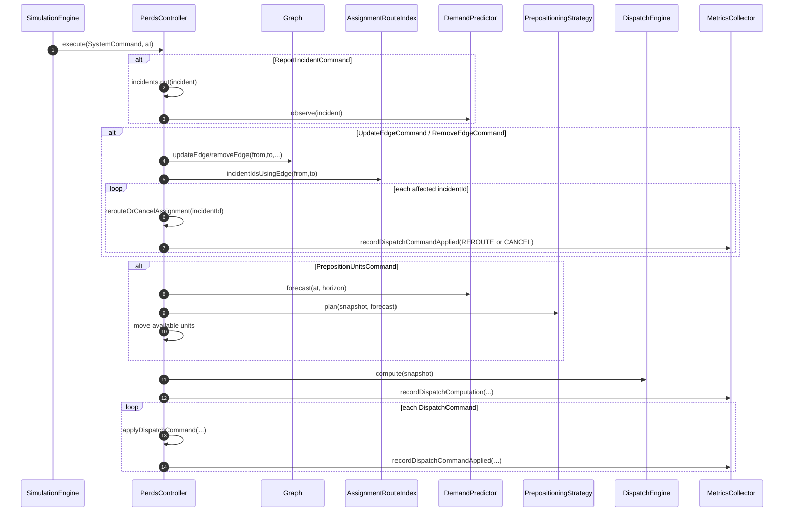
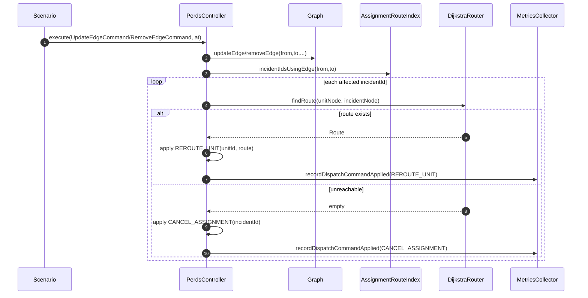
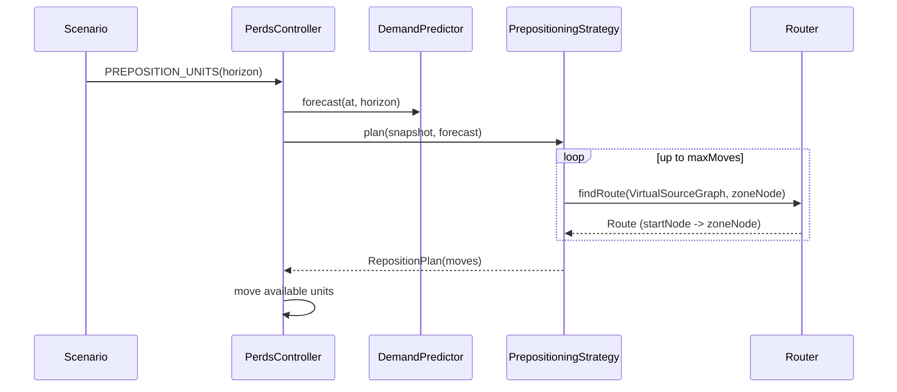
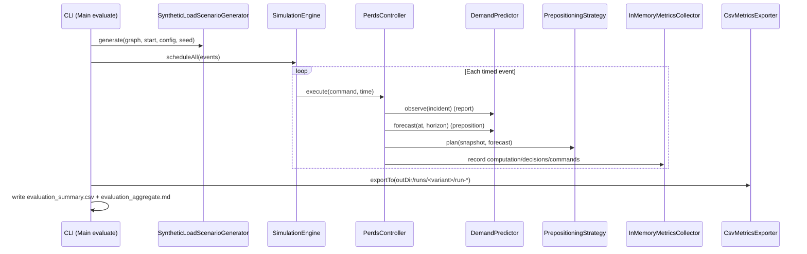

# Diagrams (Rendered On GitHub)

GitHub renders Mermaid diagrams **only** when they are inside a Markdown fence (` ```mermaid ... ``` `).
This page contains multiple diagrams — there are no “slides”; just scroll, or jump using the table of contents below.

This folder keeps two things:

- **Current diagrams (rendered below)**: these represent the latest system.
- **Legacy diagrams (not rendered)**: older snapshots kept as reference only.

## Current Diagrams (Latest System)

- 1) System Class Diagram (Current)
- 2) Per-Event Controller Step (Current)
- 3) Edge Update: Targeted Reroute / Cancel (Current)
- 4) Pre-positioning (Current)
- 5) Synthetic Evaluation Runner (Current)

### 1) System Class Diagram (Current)

Source: `current-system-class-diagram.mmd`

```mermaid
classDiagram
    direction LR

    class Main
    class CsvGraphLoader
    class CsvScenarioLoader
    class SimulationEngine
    class TimedEvent
    class SystemCommand
    class SystemCommandExecutor {
        <<interface>>
        +execute(SystemCommand, Instant)
    }

    Main --> CsvGraphLoader : loads
    Main --> CsvScenarioLoader : loads
    Main --> SimulationEngine : schedules
    Main --> SystemCommandExecutor : drives

    SimulationEngine --> TimedEvent : priority queue
    TimedEvent --> SystemCommand : contains
    SystemCommandExecutor --> SystemCommand : executes

    class PerdsController
    SystemCommandExecutor <|.. PerdsController

    class GraphReadView {
        <<interface>>
        +getNode(NodeId) Optional~Node~
        +nodeIds() Collection~NodeId~
        +outgoingEdges(NodeId) Collection~Edge~
        +getEdge(NodeId, NodeId) Optional~Edge~
        +version() long
    }

    class GraphWriteOps {
        <<interface>>
        +addNode(Node) long
        +removeNode(NodeId) long
        +putEdge(Edge) long
        +removeEdge(NodeId, NodeId) long
        +updateEdge(NodeId, NodeId, EdgeWeights, EdgeStatus) long
    }

    class Graph {
        <<interface>>
    }
    GraphReadView <|-- Graph
    GraphWriteOps <|-- Graph

    class AdjacencyMapGraph
    Graph <|.. AdjacencyMapGraph
    PerdsController --> Graph : owns

    class AssignmentRouteIndex
    PerdsController --> AssignmentRouteIndex : indexes routes

    class DispatchEngine {
        <<interface>>
        +compute(SystemSnapshot) List~DispatchCommand~
    }
    class DefaultDispatchEngine
    DispatchEngine <|.. DefaultDispatchEngine
    PerdsController --> DispatchEngine : computes

    class IncidentPrioritizer {
        <<interface>>
        +comparator() Comparator~Incident~
    }
    class SeverityThenOldestPrioritizer
    IncidentPrioritizer <|.. SeverityThenOldestPrioritizer
    DefaultDispatchEngine --> IncidentPrioritizer : orders incidents

    class DispatchPolicy {
        <<interface>>
        +choose(SystemSnapshot, Incident) Optional~DispatchDecision~
    }
    class NearestAvailableUnitPolicy
    class MultiSourceNearestAvailableUnitPolicy
    DispatchPolicy <|.. NearestAvailableUnitPolicy
    DispatchPolicy <|.. MultiSourceNearestAvailableUnitPolicy
    DefaultDispatchEngine --> DispatchPolicy : selects unit

    class Router {
        <<interface>>
        +findRoute(GraphReadView, NodeId, NodeId, EdgeCostFunction) Optional~Route~
    }
    class DijkstraRouter
    class AStarRouter
    Router <|.. DijkstraRouter
    Router <|.. AStarRouter
    NearestAvailableUnitPolicy --> Router : routes
    MultiSourceNearestAvailableUnitPolicy --> Router : routes

    class VirtualSourceGraphView
    GraphReadView <|.. VirtualSourceGraphView
    MultiSourceNearestAvailableUnitPolicy --> VirtualSourceGraphView : wraps graph

    class IndexedMinPriorityQueue {
        <<interface>>
        +insert(int, double)
        +extractMin() int
        +decreaseKey(int, double)
    }
    class BinaryHeapIndexedMinPriorityQueue
    IndexedMinPriorityQueue <|.. BinaryHeapIndexedMinPriorityQueue
    DijkstraRouter --> IndexedMinPriorityQueue : uses
    AStarRouter --> IndexedMinPriorityQueue : uses

    class DemandPredictor {
        <<interface>>
        +observe(Incident)
        +forecast(Instant, Duration) DemandForecast
    }
    class AdaptiveEnsembleDemandPredictor
    class SlidingWindowDemandPredictor
    class ExponentialSmoothingDemandPredictor
    DemandPredictor <|.. AdaptiveEnsembleDemandPredictor
    DemandPredictor <|.. SlidingWindowDemandPredictor
    DemandPredictor <|.. ExponentialSmoothingDemandPredictor
    PerdsController --> DemandPredictor : observes + forecasts

    class PrepositioningStrategy {
        <<interface>>
        +plan(SystemSnapshot, DemandForecast) RepositionPlan
    }
    class GreedyHotspotPrepositioningStrategy
    class MultiHotspotPrepositioningStrategy
    PrepositioningStrategy <|.. GreedyHotspotPrepositioningStrategy
    PrepositioningStrategy <|.. MultiHotspotPrepositioningStrategy
    PerdsController --> PrepositioningStrategy : repositions

    class MetricsCollector {
        <<interface>>
        +recordDispatchComputation(...)
        +recordDispatchDecision(...)
        +recordDispatchCommandApplied(...)
    }
    class InMemoryMetricsCollector
    MetricsCollector <|.. InMemoryMetricsCollector
    PerdsController --> MetricsCollector : records

    class MetricsExporter {
        <<interface>>
        +exportTo(Path)
    }
    class CsvMetricsExporter
    MetricsExporter <|.. CsvMetricsExporter
    Main --> MetricsExporter : exports

    class SyntheticLoadScenarioGenerator
    Main --> SyntheticLoadScenarioGenerator : generates

    class ScenarioSummary
    Main --> ScenarioSummary : aggregates
```



### 2) Per-Event Controller Step (Current)

Source: `current-controller-step-sequence.mmd`



### 3) Edge Update: Targeted Reroute / Cancel (Current)

Source: `current-edge-update-reroute-sequence.mmd`



### 4) Pre-positioning (Current)

Source: `lower-first-prepositioning-sequence.mmd`



### 5) Synthetic Evaluation Runner (Current)

Source: `first-class-evaluation-sequence.mmd`



## Legacy Diagrams (Reference Only, Not Rendered)

These are kept as a historical trail (what you built on), but they are **not embedded** here:

- `third-class-class-diagram.mmd` (baseline)
- `third-class-dispatch-sequence.mmd` (baseline)
- `upper-second-route-invalidation-sequence.mmd` (older 2:1 snapshot)
- `lower-first-reroute-sequence.mmd` (older reroute snapshot)

If you ever want to render a legacy diagram, copy its contents into a ` ```mermaid` block in a Markdown file or paste into https://mermaid.live.
