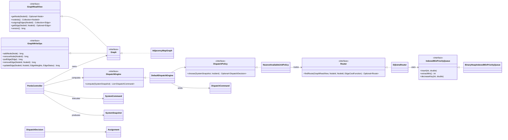
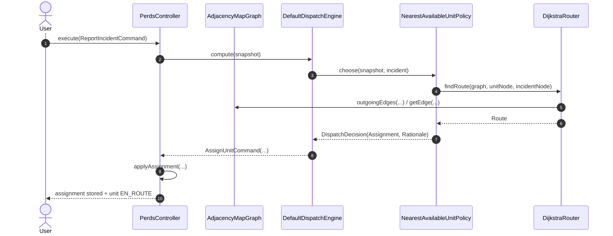
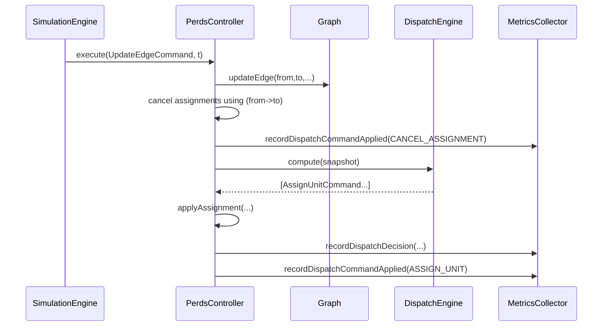
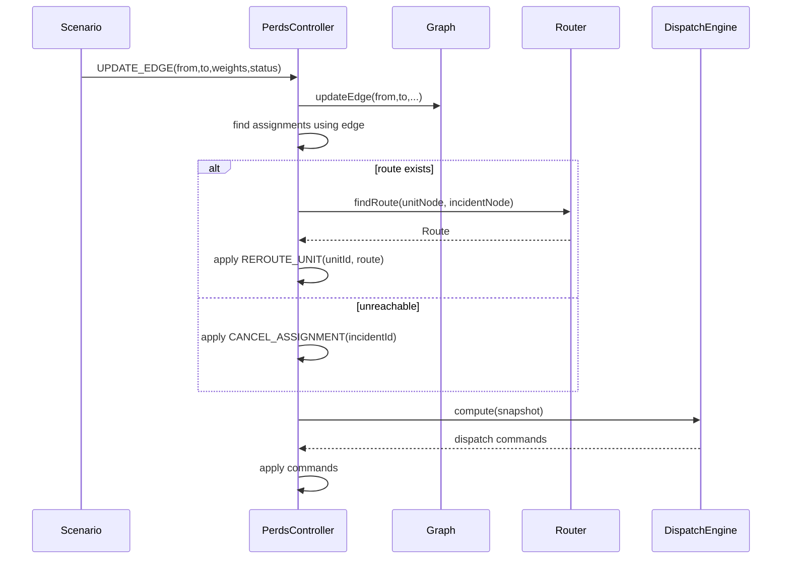
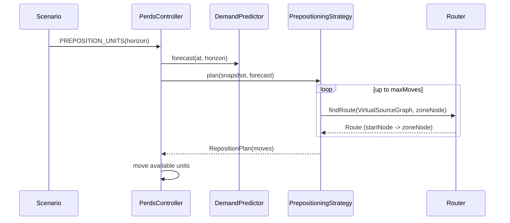
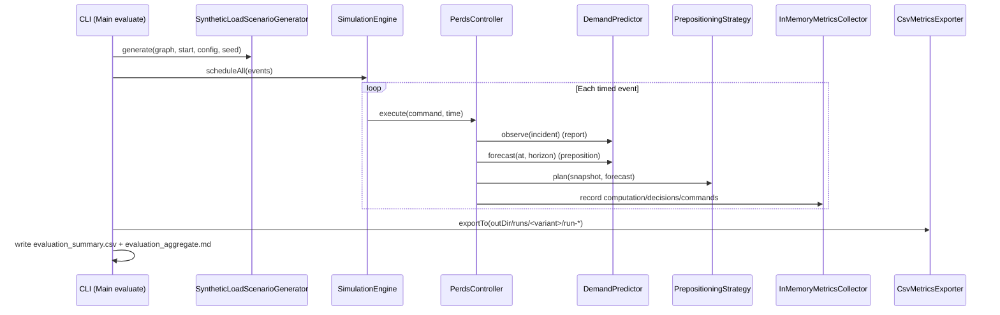

# Diagrams

Store diagrams in text-first formats (e.g., Mermaid, PlantUML source, Graphviz `.dot`) so they can be version-controlled.

GitHub only renders Mermaid when the diagram is inside a Markdown code fence (` ```mermaid ... ``` `).
The `.mmd` files in this folder are raw Mermaid source; the sections below embed the same content so it renders directly on GitHub.

If you edit a `.mmd` file, copy/paste its contents into the matching Mermaid block below.

## Third Class: Class Diagram

Source: `third-class-class-diagram.mmd`



## Third Class: Dispatch Sequence

Source: `third-class-dispatch-sequence.mmd`



## Upper Second (2:1): Route Invalidation on Edge Closure

Source: `upper-second-route-invalidation-sequence.mmd`



## Lower First: Reroute on Congestion / Edge Update

Source: `lower-first-reroute-sequence.mmd`



## Lower First: Pre-positioning Sequence

Source: `lower-first-prepositioning-sequence.mmd`



## First Class (80-100): Synthetic Evaluation Sequence

Source: `first-class-evaluation-sequence.mmd`


